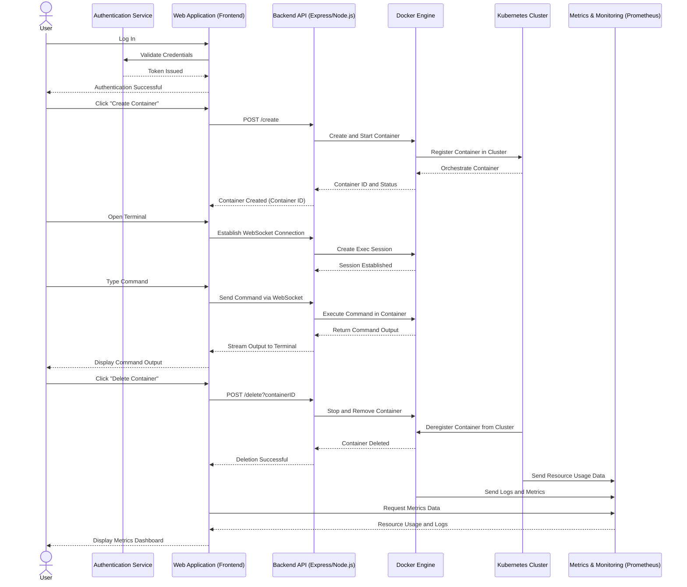

# Docker Terminal Web Interface

A web-based application that allows users to dynamically create, manage, and interact with Docker containers through an interactive terminal interface.

## Features

- Create Ubuntu containers on demand
- Interactive terminal interface for each container
- Real-time command execution
- Container management (create/delete)
- List all running containers
- Connect to any container's terminal

## Prerequisites

Before you begin, ensure you have the following installed:

1. **Node.js and npm**
   - Download and install from [Node.js official website](https://nodejs.org/)
   - Recommended version: 14.x or higher
   - Verify installation:
     ```bash
     node --version
     npm --version
     ```

2. **Docker**
   - For Windows/Mac: Download and install [Docker Desktop](https://www.docker.com/products/docker-desktop)
   - For Linux: Install Docker Engine
     ```bash
     sudo apt-get update
     sudo apt-get install docker-ce docker-ce-cli containerd.io
     ```
   - Verify installation:
     ```bash
     docker --version
     ```

## Installation

1. Clone the repository:
   ```bash
   git clone <repository-url>
   cd docker-terminal-web
   ```

2. Install dependencies:
   ```bash
   npm install
   ```

3. Ensure Docker permissions (Linux only):
   ```bash
   # Add your user to the docker group
   sudo usermod -aG docker $USER
   # Log out and log back in for changes to take effect
   ```

## Running the Application

1. Start the server:
   ```bash
   npm run dev
   ```

2. Open your web browser and navigate to:
   ```
   http://localhost:3000
   ```

## Usage

1. **Creating a Container**
   - Click the "Create Container" button
   - Wait for the container to be created and started

2. **Connecting to a Container**
   - Click the "Connect" button next to the container you want to access
   - The terminal below will connect to the selected container
   - Start typing commands in the terminal

3. **Deleting a Container**
   - Click the "Delete" button next to the container you want to remove
   - The container will be stopped and removed

## Common Commands

Once connected to a container, you can use standard Linux commands: 



